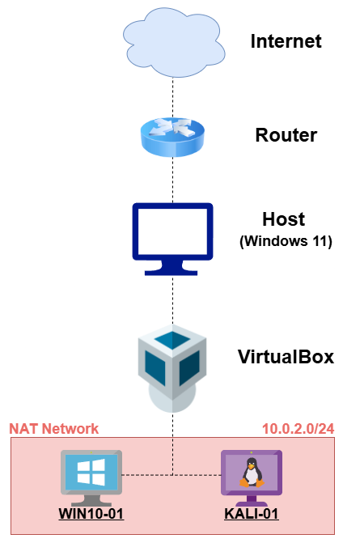

# Architecture

This directory contains the SOC home lab architecture, including diagrams documenting the evolution of the lab.

## Current Architecture

### Windows 10 Virtual Machine (WIN10-01)

WIN10-01 is the primary monitored endpoint in the lab. It generates endpoint, authentication, account management and network-related telemetry for investigation in Splunk.

- Sysmon
- Windows Event Logs
- Windows Firewall Logs
- Wireshark
- Splunk Universal Forwarder
- Splunk Enterprise

### Kali Linux Virtual Machine (KALI-01)

KALI-01 is used to generate controlled network activity against WIN10-01. This allows remote activity to be investigated from the perspective of the monitored Windows endpoint.

Current usage includes:

- Connectivity testing with ICMP
- Port scanning and service enumeration with Nmap
- SMB authentication testing
- Controlled simulation of discovery and remote access attempts

#### NAT Network

- NAT Network: `10.0.2.0/24`
- WIN10-01: `10.0.2.15`
- KALI-01: `10.0.2.3`

*The above IP addresses were assigned by DHCP at the time of validation. These addresses may change between lab sessions unless static IP addressing or DHCP reservations are configured.*

## Purpose

The current environment provides a controlled Windows endpoint for generating and investigating security telemetry using Splunk.

The lab is used to simulate and investigate:

- Authentication events
- Account management events
- Network discovery and port scanning
- Remote authentication attempts
- Windows Firewall allow/drop behaviour
- Privilege escalation
- Windows event log analysis
- SIEM investigations

Future additions may include:

- Wazuh
- pfSense
- Additional Windows endpoints

## Sysmon Parsing Fix

Sysmon logs were initially ingested into Splunk as raw XML, which made investigation difficult. The Splunk Add-on for Sysmon was installed and the Sysmon input was updated to use the correct XML Windows Event Log sourcetype. This enabled useful field extraction for Sysmon events, including CommandLine, Image, ParentImage and User.

This improvement makes future process creation investigations much easier, especially for PowerShell, scheduled task activity, command-line execution and parent-child process analysis.

## Windows Firewall Lab Rules

The Windows endpoint keeps Windows Firewall enabled. Specific inbound rules were created for controlled lab testing:

- ICMPv4 Echo Request is allowed for connectivity testing from KALI-01.
- SMB TCP/445 is allowed from KALI-01 only, to support remote authentication telemetry.

This allows blocked traffic to still be logged while permitting selected services for investigation scenarios.

## Versions

### Version 1.0 - June 2026

- Windows 10 endpoint
- Sysmon
- Windows Event Logs
- Splunk Universal Forwarder
- Splunk Enterprise

### Version 2.0 - July 2026

- Kali Linux endpoint added
- VirtualBox NAT Network used for communication between WIN10-01 and KALI-01
- Wireshark installed on WIN10-01 for packet-level validation and analysis
- Windows Firewall logging added as an additional network visibility source
