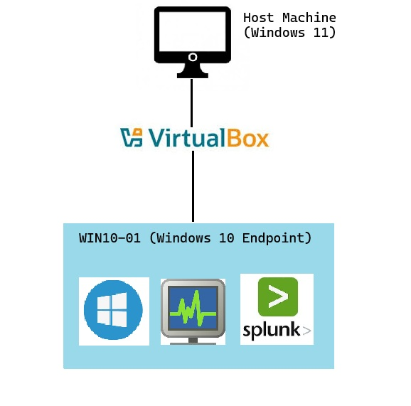

# Architecture

This directory contains the SOC home lab architecture, including diagrams documenting the evolution of the SOC home lab.

## Current Architecture

#### Windows 10 Virtual Machine (WIN10-01)
- Sysmon
- Windows Event Logs
- Splunk Universal Forwarder
- Splunk Enterprise

### Purpose

The current environment provides a controlled Windows endpoint for generating and investigating security telemetry using Splunk.

The lab is used to simulate and investigate:

- Authentication events
- Account management events
- Privilege escalation
- Windows event log analysis
- SIEM investigations

Future additions may include:

- Kali Linux
- Wazuh
- pfSense
- Internal networking
- Additional Windows endpoints

### Versions
- Version 1.0 (June 2026)
  - Windows 10 endpoint
  - Sysmon
  - Windows Event Logs
  - Splunk Universal Forwarder
  - Splunk Enterprise
