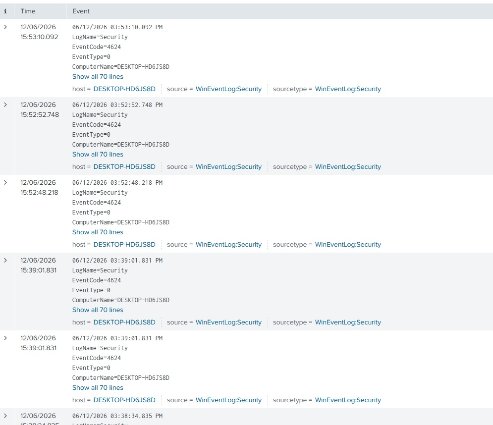
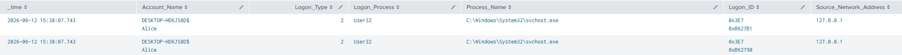
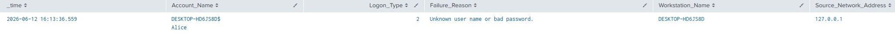
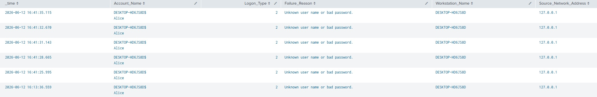
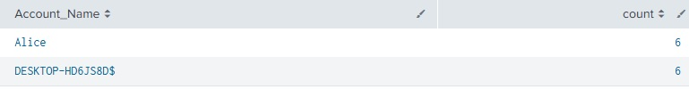
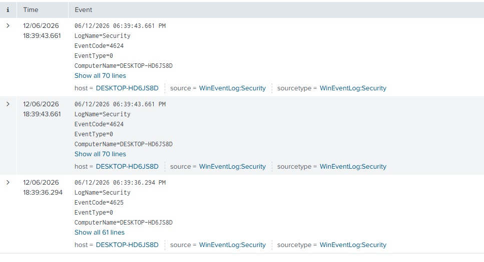
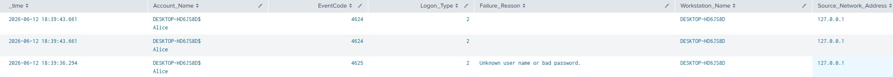

# Authentication Investigation 01 - Successful and Failed Logins

## Objective
The objective of this lab was to understand how common Windows authentication events appear within Splunk, identify the information available to an analyst, and consider how these events could be interpreted during a security investigation.

The exercise also explores potential indicators of compromise, benign explanations, and possible MITRE ATT&CK mappings where appropriate.

## Lab Setup and Tools used
- Host: Windows 11 Desktop
- SIEM: Splunk Enterprise
- Endpoint: WIN10-01 (Windows 10 Virtual Machine)
- Log Sources:
    - Windows Event Logs
    - Sysmon

## Events Investigated

## Investigation 1: Successful Login
### Action Performed
Successfully logged into the local user account *Alice* using the correct credentials.

### Evidence Collection
An initial search using "index=main EventCode=4624" returned a large number of successful authentication events.

To isolate the event generated during testing, the search was narrowed to "index=main EventCode=4624 Account_Name=Alice". The results were then formatted into a table for easier comparison.

Two Event ID 4624 entries were generated for a single successful login. Interestingly, both events shared the same field data, with the only immediate difference being the *Logon_ID* field, suggesting Windows had created multiple authentication sessions as part of the login process rather than representing two separate user login attempts.

### Event IDs
WinEventLog - 4624 (Successful Login)

### SPL Query
index=main EventCode=4624 Account_Name=Alice
| table _time Account_Name Logon_Type Logon_Process Process_Name Logon_ID Source_Network_Address

### Key Observations
- Logon Type = 2.
- Multiple 4624 events may be generated for a single user action.
- Logon ID can be used to distinguish separate authentication sessions.

### Analyst Assessment
Logon Type 2 represents an interactive local logon, typically indicating a user logging in directly at the machine.

A single user action may generate multiple Windows events, therefore analysts should avoid assuming that every 4624 event represents a separate user login.

Correlating timestamps, Logon IDs and surrounding activity provides significantly more context than examining individual events in isolation.

### Potential Security Implications
No suspicious activity was identified during this exercise.

Unexpected authentication patterns, unusual users, privileged accounts, or logons occurring outside expected hours would warrant additional investigation.

Logon Types such as 3 (Network) or 10 (Remote Interactive/RDP) are not indicators of compromise by themselves, but may require further investigation depending on organisational context.

### MITRE ATT&CK
No direct mapping for this benign activity.

## Investigation 2: Failed Login
### Action Performed
Attempted to log into Alice's account using an incorrect password.

### Evidence Collection
The following search was performed "index=main EventCode=4625 Account_Name=Alice". Unlike the successful authentication event, only a single failed authentication event was generated.

Formatting the results into a table highlighted additional fields not present in the previous investigation, particularly the Failure Reason.

### Event IDs
WinEventLog - 4625 (Failed Login)

### SPL Query:
index=main EventCode=4625 Account_Name=Alice
| table _time Account_Name Logon_Type Workstation_Name Source_Network_Address

### Key Observations
- Logon Type = 2
- Failure Reason identifies why authentication failed.
- Only a single failed authentication event was generated.

### Analyst Assessment
Logon Type 2 indicates an interactive local authentication attempt.

A single failed login is common in normal enterprise environments and may occur due to, Mistyped password, Expired password, User error or Caps Lock enabled. Without additional context or repeated failures, there is insufficient evidence to conclude malicious activity.

### Potential Security Implications
Repeated failures, unusual timing, privileged accounts or multiple source systems could increase suspicion and justify further investigation.

### MITRE ATT&CK
No direct mapping based on this single event alone.

## Investigation 3: Multiple Failed Login attempts
### Action Performed
Five consecutive failed login attempts were performed against Alice's account using incorrect credentials.

### Evidence Collection
The following "index=main EventCode=4625 Account_Name=Alice" identified the failed authentication events. The search returned the previously generated failed login together with the five newly generated events.

An additional query was used to count failed login attempts during the investigation window. The result showed six failed login attempts during the selected timeframe.

### Event IDs
WinEventLog - 4625 (Failed Login)

### SPL Querys
#### Failed login Table
index=main EventCode=4625 Account_Name=Alice
| table _time Account_Name Logon_Type Failure_Reason Workstation_Name Source_Network_Address

#### Failed login Count
index=main EventCode=4625 earliest=06/12/2026:16:00:00 latest=06/12/2026:17:00:00
| stats count by Account_Name

### Key Observations
- Logon Type = 2
- Failure Reason indicated incorrect username or password.
- Multiple failures occurred within a short period.

### Analyst Assessment
Unlike Investigation 2, the frequency of authentication failures becomes an important piece of evidence.

A single failed login is generally expected behaviour. However, Multiple consecutive failures within a short timeframe may indicate Forgotten credentials, User error, Password guessing, Brute force activity or Password spraying.

Based on this isolated lab scenario and the local interactive Logon Type, the activity appears more consistent with repeated user error than malicious behaviour.

However, in a production environment additional context would be required before reaching a conclusion.

Examples include:
- Source IP address
- Historical authentication behaviour
- Frequency over time
- Other affected accounts
- Subsequent successful authentication
- Related Sysmon process activity

### Potential Security Implications
Repeated authentication failures may represent early indicators of credential-based attacks and should be correlated with additional evidence before escalation.

### MITRE ATT&CK
Potential (context dependent):

- T1110 - Brute Force
- T1110.001 - Password Guessing
- T1110.003 - Password Spraying

### Potential Mitigations
- Multi-Factor Authentication
- Strong Password Policy
- Account Lockout Policy
- Monitoring and Alerting
- Authentication Rate Limiting

## Investigation 4: Successful Login following an Failed login attempt
### Action Performed
Successfully logged into the local user account *Alice* using the correct credentials, after a failed login attempt

### Evidence Collection
An initial SPL Search using "index=main (EventCode=4624 OR EventCode=4625) Account_Name=Alice", while setting the timeframe to only the last hour identified 3 authentication events, one failed authentication event followed by two successful authentication events associated with the same user.

To better analyse these events, they were then formatted into a table

### Event IDs
WinEventLog - 4624 (Successful Login)
WinEventLog - 4625 (Failed Login)

### SPL Query
index=main (EventCode=4624 OR EventCode=4625) Account_Name=Alice | table _time Account_Name Logon_Type Logon_Process Process_Name Logon_ID Failure_Reason Workstation_Name Source_Network_Address

### Key Observations
- Logon Type = 2
- Failure Reason identifies why authentication failed.
- Only a single failed authentication event was generated.
- A successful login was made shortly after a failed authentication failure.

### Analyst Assessment
The observed sequence consists of a single failed authentication immediately followed by successful authentication events for the same account.

A common benign explanation would be a user entering an incorrect password before successfully authenticating on a subsequent attempt.

At present there is insufficient evidence to indicate malicious activity. No repeated failures, abnormal authentication patterns or additional suspicious activity were observed during this investigation.

Further Investigation would be needed into actions performed following the user login, such as Process creation (Sysmon event ID 1), Network Connections (Sysmon event ID 3), or DNS Queries (Sysmon event ID 22).

### Potential Security Implications
Although this investigation appears benign, repeated authentication failures followed by successful authentication may represent password guessing or brute-force activity in other contexts. The significance depends on frequency, affected accounts, source systems and surrounding activity.

### MITRE ATT&CK
No direct mapping based on these events.

## Lessons Learned
- A single Windows action may generate multiple related log events.
- Individual events rarely provide sufficient evidence of malicious activity.
- Context and event correlation are essential during investigation.
- Logon Type provides valuable information when analysing authentication events.
- Repeated authentication failures may indicate malicious behaviour but require supporting evidence before conclusions are drawn.
- Analysts should distinguish between observations, interpretations and conclusions, avoiding assumptions based on isolated events.

