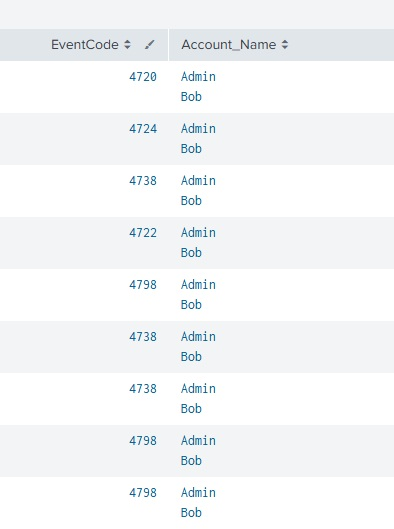
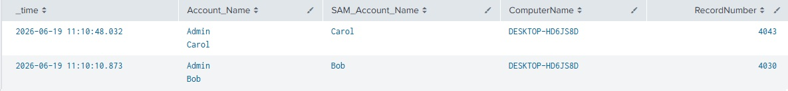
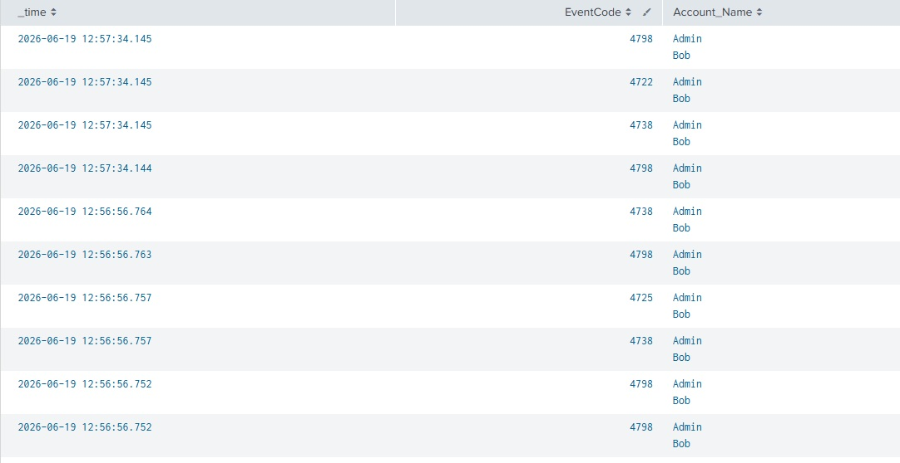
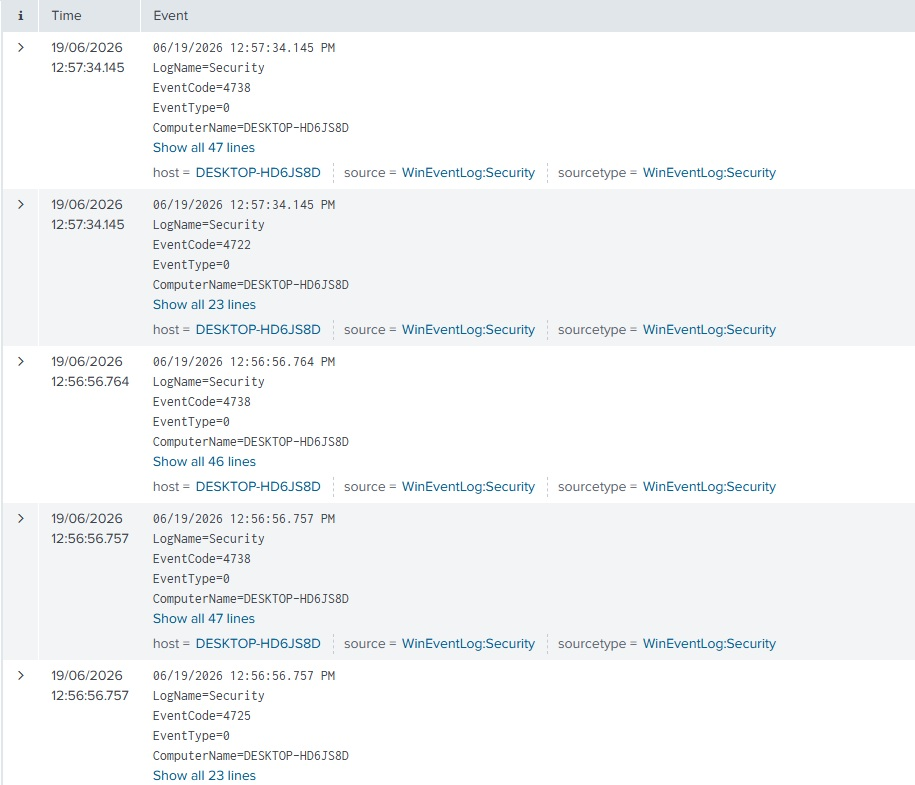
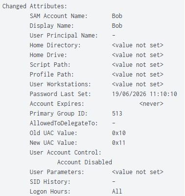
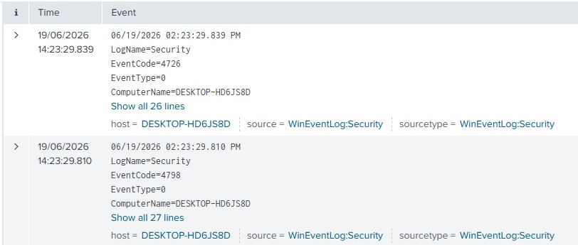
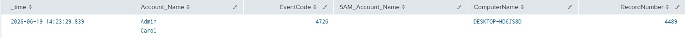
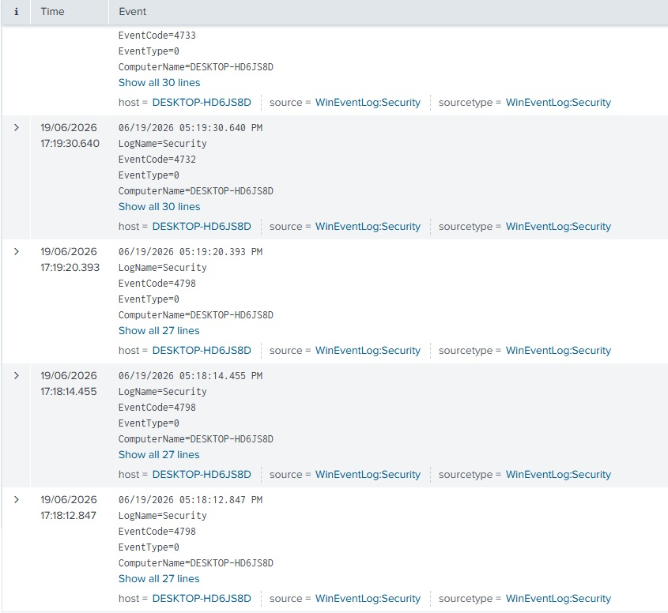
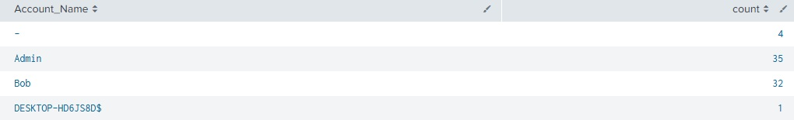

# Account Management Investigation - User accounts and User groups

## Objective
The objective of this lab was to analyse and understand common Windows account management appear in Splunk, identify the information available to an analyst, and consider how these events could be interpreted during a security investigation.

The exercise also explores potential indicators of compromise, benign explanations, and possible MITRE ATT&CK mappings / Mitigations where appropriate.

## Lab Setup and Tools used
- Host: Windows 11 Desktop
- SIEM: Splunk Enterprise
- Endpoint: WIN10-01 (Windows 10 Virtual Machine)
- Log Sources:
    - Windows Event Logs
    - Sysmon

## Events Investigated

## Investigation 1: User account Creation
### Actions Performed
Successfully create 2 local user accounts, *Bob*, and *Carol*. Bob is an *Enabled* User account, Carol is a *Disabled* User account.

### Evidence Collection
An initial search using "index=main Account_Name = Bob OR Account_Name = Carol" resulted in 28 events. These include EventIDs: 
- 4720 (User account Creation)
- 4722 (User account enabled)
- 4724 (Password Reset)
- 4725 (User account Disabled)
- 4738 (User account Changed)
- 4798 (User's local group membership enumerated)

To establish an event timeline, I formatted the table for easier analysis.

My investigation brought me to the following timeline (ignoring Local Group enumeration and User Account changing):
- 4720 - User Account was Created 
- 4724 - Password Reset (presumably password configuration)
- 4722 - User account enabled

The interesting discovery here was that Carol, the user who was created to be disabled, still followed this timeline, but had User account disabled (4725) after a number of 4738 and 4798 events.

My next area of investigation is using "index=main EventCode=4720". Two log events are present, one for Bob, one for Carol. I then decided to format this into a Table for better formatting.

Both event logs contain two Account under Account_Name, one for the account created, and one for the account who performed the account creation. We can see the SAM account name also clarifies the Account that is the target of the Account Creation. The main thing to note here is the lack of field to isolate an enabled or disabled account, which can be explained by the timeline of event explored earlier in this investigation. This however can be circumvented via an SPL search such as "index=main (EventCode=4720 OR EventCode=4722 OR EventCode=4725)"

### Event IDs
WinEventLog:
- 4720 (User account Creation)
- 4722 (User account enabled)
- 4724 (Password Reset)
- 4725 (User account Disabled)
- 4738 (User account Changed)
- 4798 (User's local group membership enumerated)

### SPL Query
#### Account Creation Timeline
index=main (Account_Name=Bob OR Account_Name=Carol)
| table _time EventCode Account_Name
| sort _time

#### Account Creation Table
index=main EventCode=4720
| table _time Account_Name SAM_Account_Name ComputerName RecordNumber

### Key Observations
- Timeline of an Account creation follows a rough pattern of: Creation > Password management > Enable Account > Account management > _Disable Account if required_.
- One 4720 event created per account creation.
- Enabling and Disabling account states can be determined correlating account creation events (4720) with subsequent enable (4722) and disable (4725) events.
- Analysts can observe who created the Account via the 4720 event.
- Password related logs may be generated through other events - such as Account creation events.

### Analyst Assessment
No indicators of compromise were identified. The observed activity was consistent with legitimate administrative account provisioning.

Two accounts were created by user Admin, one enabled and one disabled. Both events were done in quick succession, using a Desktop Machine.

A single account creation generated a large number of events, each with varying WinEventIDs, showing a timeline of the account creation. The enabled and disabled account events falled within this Account creation timeline, signifying no further account enabling and disabling took place.

Further analysis would need to be conducted to determine if persistance or privilege escalation is being attempted by an adversary, or whether the account was created via a command or script.

### Potential Security Implications
No obvious malicious activity was identified during this exercise.

The use of commandline or scripts to create an account would warrant investigation. Account creation time and Account name would be good indicators for further investigation.

Local Group modification could signify privilege escalation, and any login attempts and user activity on these accounts following the account creation should be observed to determine further indicators of compromise.

### MITRE ATT&CK
Tactic: TA003 - Persistence

Technique: T1136 - Create Account

Sub-Technique: T1136.001 - Local Account

## Investigation 2: Account Enabling and Disabling.
### Actions Performed
Account *Bob* was Disabled, followed by his account being Enabled again shortly after.

### Evidence Collection
Initially, I started my investigation by searching "index=main Account_Name = Bob" where i found 28 events. By formatting it into a table, I found 13 events correlated to account enabling and disabling, the remainder being the account creation events from Investigation 1.

I proceeded to search "index=main Account_Name = Bob AND (EventCode=4722 OR EventCode=4725 OR EventCode=4738)" to tighten my search and establish a more definitive timeline. I discovered 9 total logs, 5 being relevant to this investigation. Account Disabling has event 4725 followed by two 4738 events. Account enabling has event 4722 followed by a single 4738 event. Within the 4738 events Immediately following the Account enable and disabling, we can observe this change under the User Account Control field within Changed Attributes.

### Event IDs
WinEventLog:
- 4722 (User account enabled)
- 4725 (User account Disabled)
- 4738 (User account Changed)

### SPL Query
index=main Account_Name = Bob AND (EventCode=4722 OR EventCode=4725 OR EventCode=4738)

### Key Observations
- Each Account enable or disable generates a number of events, most importantly, a 4738 (User account Changed) event following the 4722 / 4725 event.
- Analysts can reconstruct changes to account status via event code 4738.
- Analysts can observe who enabled or disabled an account via event codes 4722 / 4725

### Analyst Assessment
No indicators of compromise were identified. The activity observed was consistent with legitimate administrative management.

A single account enabling / disabling can generate a large number of events, but the most important of these events is the 4722 / 4725 event itself, and the 4738 event immediately following it.

Further analysis into an enabled accounts activity following these events can determine further indicators of compromise, such as those consistent with persistence, privilege escalation or lateral movement.

### Potential Security Implications
No malicious activity was identified during this investigation.

Enabling high-privilege user accounts, old / unused accounts, who enabled / disabled the account, and the timing of the events should be considered to help identify potential malicious activity, and lead to what the potential attacker is aiming to achieve, such as privilege escalation.

Activity on the Enabled account should be closely monitored to determine any malicious activity following the enabling of the account.

### MITRE ATT&CK
Tactics: TA0003 - Persistence, TA0004 - Privilege Escalation

Techniques: T1078 - Valid Accounts

Sub-Techniques: T1078.003 - Local Accounts

## Investigation 3: Account Deletion
### Actions Performed
Successfully deleted account *Carol*.

### Evidence Collection
To start the investigation, i searched "index=main Account_Name = Carol" which resulted in 2 events for Carol's account being deleted, a 4798 event followed by a 4726 (Account Deleted) event.

An interesting observation was the lack of 4738 events here. I then put the event into a table for further analysis.

We can see under Account_Name two accounts, Admin and Carol, however it should be noted that SAM_Account_Name is blank within the 4726 event. This may be because the account information is no longer fully available once the deletion event is generated, however further investigation would be required to confirm this behaviour.

### Event IDs
WinEventLog:
- 4726 (Account Deleted)

### SPL Query
index=main Account_Name = Carol EventCode = 4726 | table _time Account_Name EventCode SAM_Account_Name ComputerName RecordNumber

### Key Observations
- Only 2 events were generated for an account deletion.
- SAM Account name empty for 4726 events.
- Accounts involved in Account Deletion can be seen through Account_Name field.
- Further details into the Account Deletion event can be seen within the event.

### Analyst Assessment
No indicators of compromise were identified. Appears to be standard administrative account management.

A single Account deletion was performed on a disabled account generating 2 events, with the 4726 event being the important event. Through this event, we can see what account was deleted, who deleted it and what time it was deleted.

Activity occurring prior to the account deletion should be investigated for potential indicators of compromise.

### Potential Security Implications
No malicious activity was discovered.

The activity on the deleted account prior to deletion should be investigated in case an attacker is attempting to hide any possible tools or tactics.

Unexpected deletion of privileged, service, or administrative accounts may indicate an attempt to disrupt operations or remove access for legitimate users.

The account itself should be considered, in case it contains important information that an attacker is trying to delete to disrupt the business. Finally, the time and the account that performed the deletion should be considered to determine if it was normal administrative account management.

### MITRE ATT&CK
Tactics: TA0112 - Defense Impairment, TA0040 - Impact.

Techniques: T1531 - Account Access Removal.

## Investigation 4: Change in Local Group (Privilege Escalation)
### Actions Performed
Add *Bob* to Administrators local group, followed shortly by the removal of Bob from the Administrators group.

### Evidence Collection
To start my investigation, I searched "index=main Account_Name = Bob". This resulted in 3 events, all of them with code 4798. Realising the 2 events I was looking for wasn't revealed with this search alone, I expanded the search to "index=main Account_Name = Bob OR (EventCode = 4732 OR EventCode = 4733)", which gave us a result of 5 logs, the three from the first search and the two logs for Adding and Removing Bob from the Local group Administrators.

Interestingly, the 4798 events were before the two add and remove from local group events. I decided to turn my investigation to these two events, and to analyse the content within them.

What i discovered was that there was no field containing Bob as the user that was altered. This would explain why my first investigative search did not result in these logs appearing. To further analyse what im seeing, I formatted the results into a table.

From this table, we can deduce the following information. Firstly, event 4732 occured apporximately 40 seconds before 4733, signifying the account(s) were added to a local user group, and shortly after were removed from a local user group. Looking towards Group_Name we can see the local user group that the user(s) were added to and removed from was *Administrators*. Furthermore Account_Name shows us Admin was involved in this process, and looking at the individual logs, we see they were the initiator of the change in local user groups. However, its crutial to note the affected Account_Name is blank, meaning we have no evidence from this alone if the change really was Bob. Our final piece of information is the Security_ID field which shows 3 separate IDs. These IDs are linked to the users and the Administrator user group. We can deduce from the event logs that the middle Security ID, more specifically, the one ending with 1003, is linked to our affected user. Therefore, I needed a search that pinpoints our Security ID to a user.

By searching for the security_ID across the day, and Counting how many Account names are in each event, we can see that there are two candidates for us to consider. The first is Admin, the second is Bob. We deduced earlier in our investigation that Admin's Security ID ends in 1002, therefore, Admin can be ruled out, leaving only Bob to be the user with this Security ID.

### Event IDs
WinEventLog:
- 4732 (User added to a Local Group)
- 4733 (User removed from a Local Group)

### SPL Query
#### Local user group Table
index=main (EventCode = 4732 OR EventCode = 4733) | table _time EventCode Account_Name Security_ID Group_Name ComputerName

#### Stats to find the user of a Security ID
index=main Security_ID = S-1-5-21-1728947036-2204690024-3372405300-1003 | stats count by Account_Name

### Key Observations
- Account_Name cannot always be used to identify users, requiring us to link Security IDs to an Account_Name.
- Group_Name can show what user group the account was added or removed from.
- The 4732 and 4733 events provided the primary evidence for local group modification, while additional investigation was required to correlate the affected SID with a specific user account.
- Looking into the Events themselves can be used to link Security IDs and other fields / activity to an Account_Name.

### Analyst Assessment
While the use of Local User Group adding / removal is suspicous, no Indicators of compromise appeared. Appears to be Administrators user group management.

The Account name *Admin* added Bob to the Administrators user group, followed shortly by the removal of Bob from the Administrators user group. These events were roughly 40 seconds apart. 

While 40 seconds is a short timeframe, it may be important to investigate if Bob managed to do any action within this window that could be seen as Malicious or harmful.

### Potential Security Implications
No Malicious activity was found.

The time, Account performing the Local group changes, and the recipient of these changes must be considered to help clarify the intent behind the change.

Activity of the account that performed the local group changes should be investigated to determine if an attack on this user was achieved. Furthermore the activity of the recipient should also be monitored, including if the account was recently created or enabled, or if it performed any malicious activity following its change in Local user group.

Unexpected addition of accounts to the Administrators local group may indicate privilege escalation, persistence, or attempts to establish long-term access.

### MITRE ATT&CK
Tactics: TA0004 - Privilege Escalation, TA0003 - Persistence

Techniques: T1098 Account Manipulation

## Lessons Learned
- A single user action can generate multiple Windows Event Logs, requiring event correlation rather than analysis of individual events in isolation.

- Event IDs provide useful context, but additional investigation into fields, timelines and related events is often required to understand what actually occurred.

- Account creation follows a predictable sequence of events rather than generating a single log entry.

- Account enablement and disablement can be reconstructed through Event IDs 4722, 4725 and 4738, with account status changes visible within the User Account Control attributes.

- Account deletion generates fewer logs than account creation or modification, and may not generate the same supporting events seen during other account-management actions.

- Usernames are not always present within relevant events. Security Identifiers (SIDs) may need to be correlated across multiple logs to identify the affected account.

- Group membership changes can be investigated through Event IDs 4732 and 4733, making them useful indicators of potential privilege escalation or persistence.

- The Group Name, initiating account and affected account are often more important than the Event ID itself when determining the security significance of a group modification.

- Understanding normal administrative activity is essential before malicious activity can be accurately identified.

- Context is often more important than the event itself. The same event may be benign or malicious depending on who performed the action, when it occurred and what activity followed.

- Investigating activity before and after an event is often necessary to determine intent and identify potential indicators of compromise.

- Effective security monitoring depends on understanding both how logs are generated and how they are collected, forwarded and stored.

- Developing an investigative methodology is more valuable than memorising individual Event IDs, as real-world investigations require correlation, validation and evidence-based conclusions.