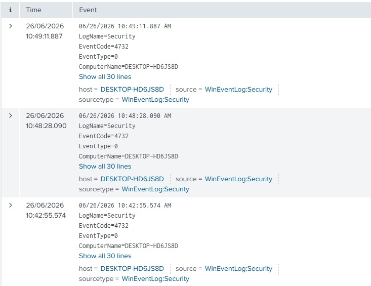
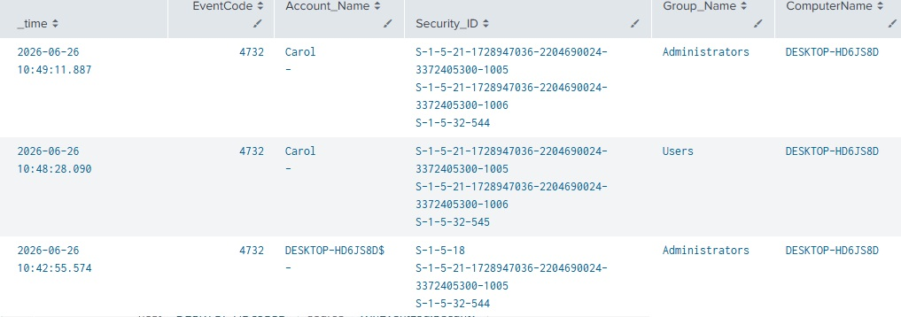
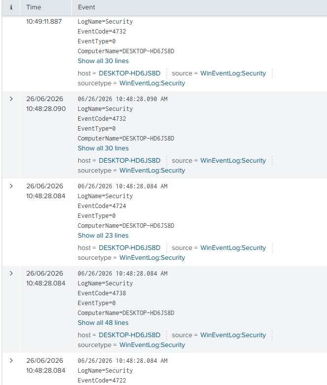
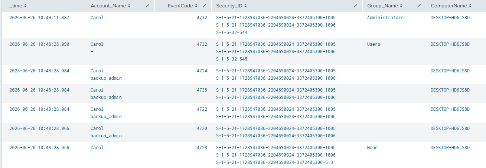
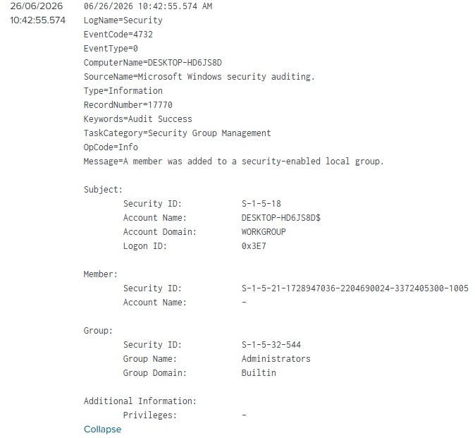
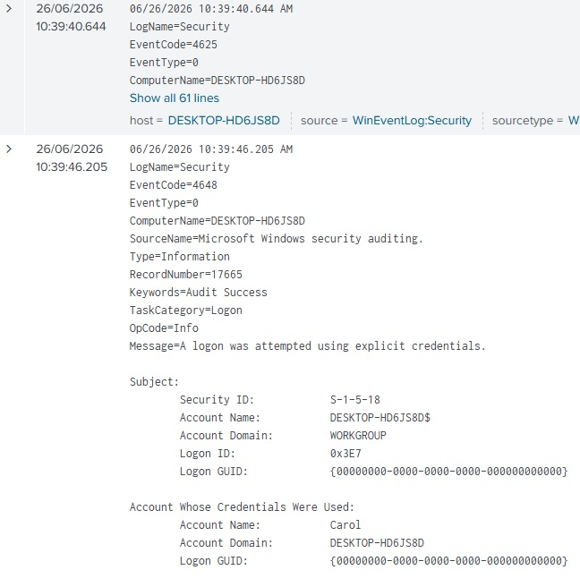
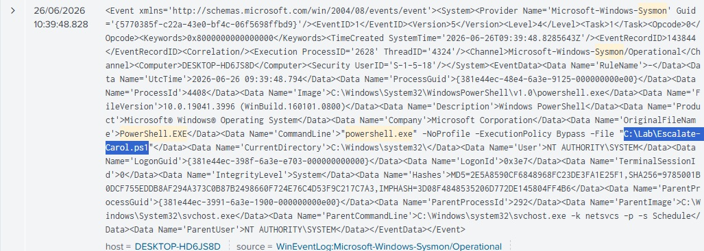
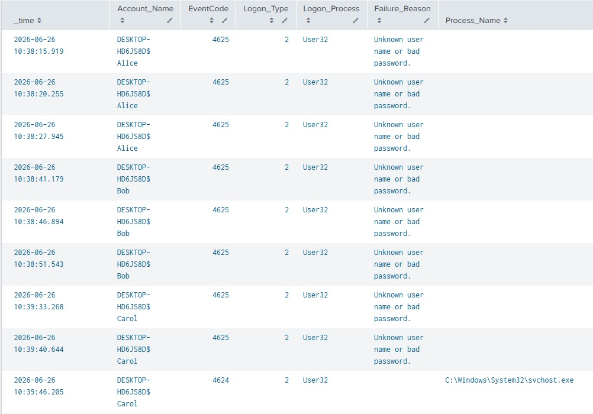

# Suspected Password Spraying followed by Privilege Escalation and Persistence Scenario 

## Objective
This lab follows the following Scenario:

An alert was generated at 10:42:55 AM showing that user Carol had been added to the local Administrators group.

This scenario simulates a password spraying attack, followed by a successful login to a standard user account. The environment contains a pre-staged local misconfiguration: A scheduled task configured to run with SYSTEM privileges when Carol logs in. This allows the investigation to observe privilege escalation telemetry without relying on a live exploit. Therefore, this scenario combines what I learned in Lab 01 (Authentication Events) and in Lab 02 (Account Management Events).

## Lab Setup and Tools used
- Host: Windows 11 Desktop
- SIEM: Splunk Enterprise
- Endpoint: WIN10-01 (Windows 10 Virtual Machine)
- Log Sources:
    - Windows Event Logs
    - Sysmon

## Investigation 
### Actions Performed (Attack Steps)
3 failed login attempts were made on *Alice* and *Bob's* user account. Then 2 failed logins were made for *Carol's* user account, followed by a successful login. After this, I logged out of Carol and logged back into Carol to get a new login session, and so the script that raised Carol's user group privilege could take effect. Carol's password was then changed, a new account *backup_admin* was created, and backup_admin was added to the Administrators local group. Carol's account logged out following this activity.

### Evidence Collection
To start my investigation, I searched for "index=main EventCode = 4732" which resulted in 3 events.

As I only expected to see 1 event, I formatted it into a table to aid in analysis.

From the Alert generated in the Scenario, I know the bottom event is what was flagged based on the time of the event (10:42 AM). This event reveals that the user that has a Security_ID ending with "1005" was added to *Administrators* user group. This user can be identified as *Carol* by observing the other 2 events, where this Security_ID is linked to the user Carol. However, it can also be deduced that the user Carol also modified a users privilege to Users, and then to Administrators just over 30 seconds later. This user that Carol's account modified ends with "1006", therefore, our next Investigation must be to identify this user.

Upon searching for this user, I identified 14 events, many being event code "4798". I excluded these events from my search to discover 7 events for this user, each with different event codes.

Putting these results into a table greatly aided in identifying Who and What is happening with this user.

The user "backup_admin" can be identified as the user with the Security_ID we are looking for, however, more importantly, looking at the timeline of events we can see what is really going on. The first three events (at the bottom), shows eventcodes 4728, 4720 and 4722. This clearly indicates that "backup_admin" is a new user that was created, and by looking at Account_Name, we can deduce Carol's user account was the one to create it. Following this, we see event codes 4738, 4724 and 4732, these appear to be the user account setup, as we can see password rest and user account modified changes, along with the user group being set to user. All 6 of these events so far are executed relatively at the same time (10:48:28 AM). The last event shows Carol's user account changed backup_admin's local user group to Administrators. No other events occurred with this account, and a quick search for the "backup_admin" user account confirms no further events for this account was made thus far.

We can confirm so far, that Carol's user account had their Local user account set to Administrator, and then created the user "backup_admin" and raised this account to local user group "Administrator" alongside Carol. However, a search for what lead to Carol gaining the Privilege level of Administrator's must be our next step, along with any other events this user may have executed after gaining administrator privileges.

Upon searching for Carol while excluding event code "4798", we have 173 events, far too many to analyse. Therefore, I narrowed my search to only Account management events, and formatted it into a Table. I achieved this by searching for only event codes with the range of 4720 and 4740 inclusive.

Now we have narrowed our search to 9 account management events. Out of these, we can see 7 events that we have seen before as they are related to "backup_admin". The other 2 events are therefore more interesting, which have event codes 4723 followed by 4738. This is an important piece of information as it indicates that a password change attempt was made for Carol's account, followed by the account being modified. In this context, this may indicate Carol's password was changed after privilege escalation. This raises our suspicion of the Carol user accounts activity as possible Persistence and Defense Impairment could be attempted. However, the other important piece of information is that no other accounts were modified, created or deleted by Carol at this time.

From this point, we have gained some valuable information on what happened after Carol gained her raised privilege, but I now pivoted to looking at how this escalation was achieved. Looking back at the raw data of the original 4732 log, I got some information I previously overlooked.

The Subject field, which denotes who provided the change in local user group, has a security ID and Account_Name that indicates this wasn't a user that provided the privilege escalation, but the Local System. This was identified after looking into the Security ID - which is the Security ID of the Local System, and also the Account Name being the machine itself rather than a specific user.

To further understand what happened here, i narrowed the time to be around 3 minutes before, and 3 minutes after this event, and searched for the Security ID tied to the Local System. Here I found a lot of interesting events.

I found 2 failed login events, followed by a successful login for Carol's account. In addition, I found a lot of events with the following codes: 4648, 4799, 4672, 4674. These events are tied to events such as Local group enumeration and Special Privileges assigned to new logon. This along with the original 4732 event confirms Carol was added to the local Administrators group by a SYSTEM-level process. While the process hasn't yet been deduced through windows event security logs, Sysmon would be required to confirm whether this was caused by a scheduled task, script, service or local mechanism.

As Sysmon logs are not properly configured for this instance of Splunk, i searched manually for Sysmon logs as the source, along with common execution processes such as cmd.exe and schtasks.exe to narrow down the sysmon events for this period. This resulted in 18 events. Analysis found that many had cmd.exe as the process, but more importantly, I found events for taskhostw.exe - A scheduled task execution process. In addition to this, a powershell.exe log showing a script was executed.

Sysmon Event ID 1 showed powershell.exe executing as `NT AUTHORITY\SYSTEM`. The command line included `-ExecutionPolicy Bypass` and executed `C:\Lab\Escalate-Carol.ps1`. The parent process was svchost.exe running the Schedule service, indicating the script was launched by Task Scheduler. This aligns with the subsequent Security Event ID 4732 where Carol was added to the local Administrators group.

Following this, I decided to investigate the two failed login attempts I discovered earlier. 

What I discovered was interesting. Here I found multiple failed login attempts. Upon further analysis, it appears 3 failed login attempts were attempted on Alice and Bob's accounts, followed by 2 failed logins on Carol's account, then a successful login on Carol's account. This pattern is very similar to those of Password Spraying attacks - whereby a small set of common passwords are attempted on multiple accounts, with low enough attempts to not trigger account lockout and to evade detection. It should also be noted that the logon type is 2, which signifies an interactive logon. 

### Event IDs
WinEventLog:
- 4624 (Successful login)
- 4625 (Failed Login)
- 4648 (Login using explicit credentials)
- 4672 (Special privileges assigned to new logon)
- 4674 (Operation attempted on privileged object)
- 4720 (User Created)
- 4722 (User Enabled)
- 4723 (Password Change)
- 4732 (User added to a Local Group)
- 4733 (User removed from a Local Group)
- 4738 (User Account Modified)
- 4799 (Local group membership enumerated)

Sysmon:
- 1 (Process Creation)

### SPL Queries
#### Privilege Escalation Analysis Table
index=main EventCode = 4732 | table _time EventCode Account_Name Security_ID Group_Name ComputerName

#### Security ID user Search Table
index=main Security_ID = S-1-5-21-1728947036-2204690024-3372405300-1006 AND NOT EventCode = 4798 | table _time Account_Name EventCode Security_ID Group_Name ComputerName

#### Account Management Table
index=main Account_Name = Carol AND (EventCode >= 4720 AND EventCode <= 4738) | table _time Account_Name EventCode Security_ID Group_Name ComputerName

#### Sysmon event search
index=main earliest="06/26/2026:10:39:30" latest="06/26/2026:10:40:00" Sysmon ("powershell.exe" OR "cmd.exe" OR "net.exe" OR "net1.exe" OR "schtasks.exe" OR "taskeng.exe" OR "taskhostw.exe") | reverse

#### Login success / failure table search
index=main (EventCode = 4624 OR EventCode = 4625) AND NOT Logon_Type = 5 | table _time Account_Name EventCode Logon_Type Logon_Process Failure_Reason Process_Name Logon_ID Source_Network_Address | reverse

### Key Observations
- Carol was added to Administrators by S-1-5-18 / LOCAL SYSTEM.
- Carol's account created a new user - backup_admin
- backup_admin was added to the Administrators local group.
- The newly created account was initially represented by SID, requiring correlation.
- Sysmon showed PowerShell executing as NT AUTHORITY\SYSTEM.
- The PowerShell process was launched by the Task Scheduler service and executed C:\Lab\Escalate-Carol.ps1.
- Multiple failed logins occurred against Alice, Bob and Carol before Carol's successful login.
- The failed login attempts showed patterns similar to Password Spraying.
- Carol's account showed password/account modification activity after elevation.

### Analyst Assessment
Evidence suggests the simulated password spraying activity resulted in successful access to Carol's account. Shortly after Carol's successful login, a pre-existing scheduled task executed a PowerShell script as NT AUTHORITY\SYSTEM, resulting in Carol being added to the local Administrators group.

Following this privilege escalation, Carol's account performed several account-management actions, including password/account modification, creating a new local user named backup_admin, and adding that account to the local Administrators group.

This activity is consistent with a simulated attack chain involving password spraying, successful use of a valid account, privilege escalation through a local scheduled task misconfiguration, and possible persistence through creation of a new administrator account.

### Potential Security Implications
The evidence provides medium-to-high confidence that the observed activity represents the simulated attack chain.

The failed login pattern suggests weak password controls or insufficient account lockout protection. The successful login to Carol's account, followed by privilege escalation, demonstrates how compromise of a standard user account can lead to administrator-level access when local misconfigurations exist.

The scheduled task misconfiguration allowed SYSTEM-level PowerShell execution, which resulted in Carol being added to the local Administrators group. This could allow an attacker to perform privileged actions on the endpoint.

The creation and elevation of backup_admin could provide persistent access to the system. The password/account modification activity may also impair recovery or help maintain control of the compromised account.

Further activity from both Carol and backup_admin should be monitored for signs of additional malicious behaviour, including lateral movement, command-and-control activity, data staging, or data exfiltration.

### MITRE ATT&CK
Tactics: TA0003 - Persistence, TA0004 - Privilege Escalation

Techniques: T1078 - Valid Accounts, T1098 - Account Manipulation

Subtechniques: T1110.003 - Password Spraying, T1053.005 - Scheduled Task, T1059.001 - PowerShell, T1136.001 - Local Account

### Potential Mitigations
- Enforce account lockout policies to reduce Brute force attacks such as Password Spraying.
- Monitor failed logins across multiple accounts within short time windows.
- Alert when standard users are added to the local Administrators group.
- Regularly review local Administrators group membership.
- Audit scheduled tasks configured to run as SYSTEM.
- Restrict who can create and modify scheduled tasks.
- Monitor PowerShell execution, especially with -ExecutionPolicy Bypass, script execution, or SYSTEM-level context.
- Enable PowerShell logging where appropriate, including script block logging.
- Quarantine or disable suspected compromised accounts during investigation.
- Maintain tested backup and recovery processes to support recovery from malicious activity such as ransomware or destructive actions.

## Lessons Learned
### Lessons Learned

- Starting from a single alert can provide a strong investigation anchor. In this scenario, the initial 4732 event showing Carol being added to the local Administrators group provided a clear starting point for reconstructing activity before and after the privilege escalation.

- Security Identifiers are important when usernames are not clearly shown in Windows events. Both Carol and `backup_admin` were initially represented by SID in key events, requiring correlation across multiple logs to identify the affected accounts.

- Windows Security logs are useful for confirming that security-relevant actions occurred, but they do not always explain how those actions happened. Event ID 4732 confirmed that Carol was added to Administrators, but Sysmon was needed to identify the PowerShell script and scheduled task mechanism behind the action.

- The Subject field in Windows Event Logs is critical. In the original privilege escalation event, the Subject Security ID was `S-1-5-18`, indicating the action was performed by `LOCAL SYSTEM` rather than directly by a normal user account.

- Sysmon process creation logs provide valuable context for understanding execution activity. Sysmon Event ID 1 showed `powershell.exe` running as `NT AUTHORITY\SYSTEM`, with the Task Scheduler service as the parent process.

- A single event rarely tells the full story. The investigation required combining authentication events, account management events, local group modification events, and Sysmon process creation logs to build a complete timeline.

- Password spraying may not appear as a large number of failed logins against a single user. In this scenario, the suspicious pattern was multiple failed logins spread across several accounts, followed by a successful login to Carol.

- Privilege escalation and persistence can occur quickly after initial access. Carol's account was elevated, then used to create and elevate `backup_admin` shortly afterwards.

- Local misconfigurations can turn standard user compromise into administrator-level access. The pre-existing scheduled task running as `SYSTEM` demonstrated how unsafe privileged automation can create an escalation path.

- Log parsing and field extraction affect investigation quality. Because Sysmon was not fully separated into clean fields in Splunk, raw text searches were required to identify process execution evidence. Improving Sysmon field extraction would make future investigations faster and more reliable.

- Evidence-based wording is important. Some events strongly confirmed activity, such as account creation and group membership changes, while others provided supporting context and required cautious interpretation.

- Timeline analysis is one of the most useful SOC investigation skills. Viewing events in sequence made it possible to connect failed logins, successful authentication, privilege escalation, PowerShell execution, account creation, and persistence activity into one coherent attack chain.
