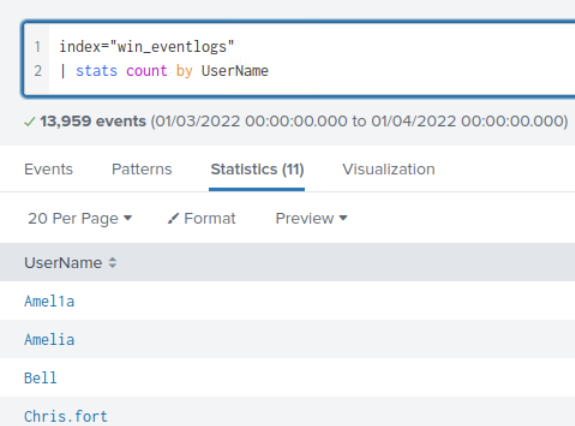
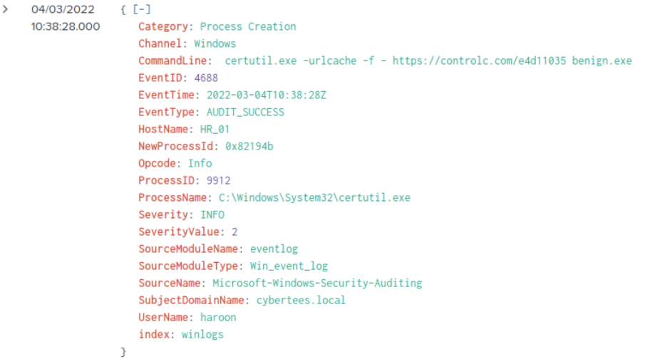
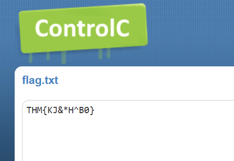

# Benign

## Overview

"Challenge room to investigate a compromised host."

## Key Concepts

- Splunk log analysis
- Suspicious malware execution
- SIEM Triage

## Investigation Steps

### How many logs are ingested from the month of March, 2022?

I opened up the splunk instance and navigated to the "Search and Reporting" section. From here I can access the relevant logs by executing a search "index=win_eventlogs". Next I altered the date range so I could access all logs from March 2022.

Answer: 13959

### Imposter Alert: There seems to be an imposter account observed in the logs, what is the name of that user?

I analysed the users by appending "| stats count by UserName" into the search field. This resulted in 11 users, including the number of logs associated with each user. From the scenario prompt, I have knowledge of 9 users, so that means 2 of the filtered users are not among this list of people in the company. One of the two users is called "SYSTEM", this is more than likely legitimate, so I continued my Investigation. This led me to a user that was trying to mimic "Amelia" by masquerading as "Amel1a" (with a 1 in the place of the i).

Answer: Amel1a

### Which user from the HR department was observed to be running scheduled tasks?

Firstly, I analysed the users in the HR department and filtered the search to only show logs from users in HR. The results were still too large for me to deduce who was running scheduled tasks, therefore I also filtered the search to find "schtasks", a windows command line utility for scheduled tasks. The result was a single log file, this is where I discovered the user who created the scheduled task **update.exe**.

Answer: Chris.fort

### Which user from the HR department executed a system process (LOLBIN) to download a payload from a file-sharing host.

I started my investigation by attempting a few different Living off the land binaries (LOLBIN) while continuing to filter the users from HR. Unfortunately this lead to a dead end. I then analysed the statistics of the Process names. I combed through these statistics and finally discovered a LOLBIN, **certutil.exe**, which only had 1 log event tied to it. I filtered the results to show the certutil.exe log, and from there I found the user that it was associated with.

Answer: haroon

### To bypass the security controls, which system process (lolbin) was used to download a payload from the internet?

I discovered the LOLBIN during the investigation in the previous question, so I already knew the answer to this.

Answer: certutil.exe

### What was the date that this binary was executed by the infected host? format (YYYY-MM-DD)

Analysis on this event log led me to the date under the EventTime field. This can also be seen in the Time column of the log.

Answer: 2022-03-04

### Which third-party site was accessed to download the malicious payload?

Further analysis led me to the command line of the log, which allowed me to discover the user fetched a payload from a website and saved it on the hosts machine as **benign.exe**.

Answer: controlc.com

### What is the name of the file that was saved on the host machine from the C2 server during the post-exploitation phase?

As per the previous question's investigation, the file saved on the host is **benign.exe**.

Answer: benign.exe

### The suspicious file downloaded from the C2 server contained malicious content with the pattern THM{..........}; what is that pattern?

I decided to open the website shown in the commandline and investigate further. Upon opening this web page, I uncovered the code I needed in the text field.

Answer: THM{KJ&*H^B0}

### What is the URL that the infected host connected to?

This is the full URL found in the command line that the attacker used to download the payload on the hosts machine (as seen in the previous questions).

Answer: https://controlc.com/e4d11035

## Key Findings

- Analysing the users revealed the attacker created a new user. This is an attempt to masquerade as an existing employee, Amelia by substituting the i for a 1
- Two users in HR appear to also be compromised, which may indicate lateral movement was achieved on **Chris.fort** and **haroon** or multiple compromised accounts.
- The user Chris.fort created a scheduled task called "update.exe" using the **schtasks** windows utility. This suggests potential malicious software was installed for persistence purposes. 
- The user haroon utilised the LOLBIN **certutil.exe** to download a payload onto the hosts machine and evade detection. 
- controlc.com was leveraged to download potential malicious executables, which was then saved as **benign.exe**, indicating successful payload delivery from an external source.

## Important notes

- The `stats` command in Splunk is effective for:
  - identifying anomalies in user activity
  - detecting potential masquerading attempts
- common LOLBIN tools observed:
    - **schtasks** is a windows command line utility that is used for scheduled tasks. Attackers are able to leverage this for persistence.
    - **certutil** is a windows command line utility that can be used to request and save payloads from external sources.
- Attackers frequently abuse legitimate tools (LOLBins) to:
  - evade detection
  - bypass application whitelisting
- Public platforms such as controlc.com can be abused for:
  - payload hosting
  - staging attacker infrastructure

## Takeaways

This lab strengthened practical SOC investigation skills, particularly in identifying attacker behaviour within SIEM logs.

- Improved proficiency in Splunk for log filtering, aggregation, and anomaly detection.
- Identified the use of Living-off-the-Land Binaries (LOLBins) such as schtasks and certutil in real attack scenarios.
- Gained experience analysing how legitimate services can be abused as part of attacker infrastructure.
- Developed understanding of attacker techniques including masquerading, persistence, and payload delivery.

Overall, this scenario simulated a realistic SOC triage involving compromised accounts, persistence mechanisms, and malicious payload delivery.
