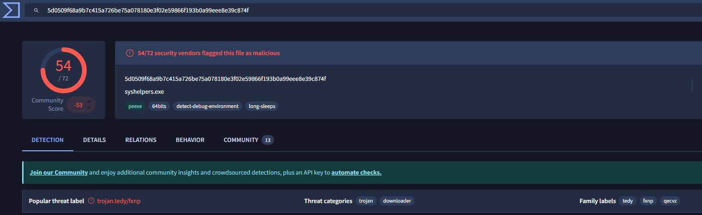
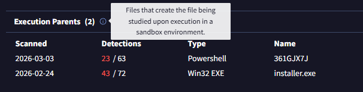
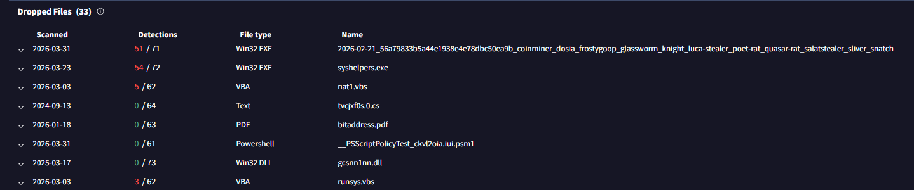
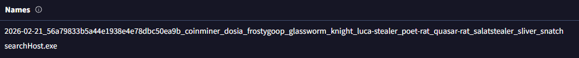
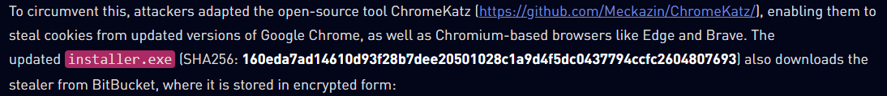

# Invite Only

## Overview

"Extract insight from a set of flagged artefacts, and distil the information into usable threat intelligence."

## Key Concepts

- Threat Intelligence
- Threat Analysis Tools
- Malware Analysis

## Investigation Steps

### What is the name of the file identified with the flagged SHA256 hash?

I searched the provided SHA256 hash on VirusTotal to get information about the file and its classification. Here I found the name of the file.

Answer: syshelpers.exe

### What is the file type associated with the flagged SHA256 hash?

Doing some investigation into the details section on VirusTotal, I found the File type field under Basic properties.

Answer: Win32 EXE

### What are the execution parents of the flagged hash? List the names chronologically, using a comma as a separator. Note down the hashes for later use.

I did some further investigation in VirusTotal to find the execution parents. I discovered the section I needed in the Relations section. Two files were seen here which gave me my answer. I opened the VirusTotal pages for each of these for later use.

Answer: 361GJX7J,installer.exe

### What is the name of the file being dropped? Note down the hash value for later use.

I looked further down the Relations section to find the Dropped Files section. The file I needed was revealed here. I also opened this on VirusTotal for future use.

Answer: AClient.exe

### Research the second hash in question 3 and list the four malicious dropped files in the order they appear (from up to down), separated by commas.

I moved over to the "installer.exe" VirusTotal page I opened prior, and did some research in the Relations section. Here I found the 4 malicious files I needed, however one of the files required more research:

I opened the VirusTotal page for the top result to find any other names the file went by. In the Details section I found 2 names for this file, this gave me the four files I needed.

Answer: searchhost.exe,syshelpers.exe,nat.vbs,runsys.vbs

### Analyse the files related to the flagged IP. What is the malware family that links these files?

I Investigated the provided IP address on VirusTotal. I was hoping for some tags to give me the malware family I was looking for, but no tags were associated with this IP. I then went into the Relations Section and researched the files associated with this IP (Communicating Files). I discovered that each of these files all shared one tag among them all, therefore I had my answer.

Answer: asyncrat

### What is the title of the original report where these flagged indicators are mentioned? Use Google to find the report.

I did some research on Google but found a lot of false positive results (Reports that were not what I was looking for). Therefore I went back to the VirusTotal page for the original provided hash that was flagged and looked at the community section to see if there were any comments related to a report. The required information was found here.

Answer: From Trust to Threat: Hijacked Discord Invites Used for Multi-Stage Malware Delivery

### Which tool did the attackers use to steal cookies from the Google Chrome browser?

I opened the report from the above question. I know I needed to find something related to Google Chrome so I searched the webpage for "Google Chrome" which gave 2 hits. The first was in a paragraph talking about the open-source tool that is used to steal Google Chrome cookies, along with Chromium-based browers such as Edge and Brave. Therefore I had found what I was looking for.

Answer: ChromeKatz

### Which phishing technique did the attackers use? Use the report to answer the question.

Again using the technique from the above question, I searched "Phishing" in the report web page. Here I found the phishing technique the attack used alongside other techniques to deliver the malware.

Answer: ClickFix

### What is the name of the platform that was used to redirect a user to malicious servers?

I knew the Answer here from the title, but I double checked by searching for "Server" in the report. This confirmed the platform used, and a flaw in its invitation system.

Answer: Discord

## Key Findings

- The analysed SHA256 hash corresponds to a malicious Win32 executable (**syshelpers.exe**).
- The file is part of a larger infection chain involving multiple dropped payloads, including scripts and executables.
- Associated infrastructure (IP address) is linked to the **AsyncRAT** malware family.
- Analysis of related artefacts revealed a multi-stage infection process leveraging Discord invite links.
- The attack chain includes:
  - ClickFix phishing technique
  - Use of ChromeKatz for browser credential/cookie theft
- Threat intelligence reports confirm this campaign targets Chromium-based browsers.

## Important notes

- VirusTotal can be used to analyse:
  - File hashes
  - IP addresses
  - Domains
- Key VirusTotal sections:
  - **Details**  File properties, metadata, aliases, submission history
  - **Relations**  Connected files, domains, and infrastructure
  - **Behaviour**  MITRE ATT&CK mapping, network activity, execution behaviour
- Pivoting between related artefacts (files, IPs, domains) is essential for building a complete threat profile.
- Threat intelligence reports provide context on:
  - Attack techniques
  - Objectives
  - Malware behaviour

## Takeaways

This lab strengthened practical threat intelligence and investigation skills, particularly when working with real-world malware indicators.

- Developed the ability to pivot between related artefacts (hashes, IPs, files) using VirusTotal.
- Improved understanding of how malware campaigns are structured across multiple stages.
- Gained experience identifying malware families (e.g. AsyncRAT) through shared indicators and tagging.
- Learned how to leverage threat intelligence reports to gain deeper context on attacker techniques and objectives.
- Strengthened ability to correlate technical findings with real-world attack scenarios.

Overall, this exercise simulated how a SOC analyst would investigate suspicious indicators and build a broader understanding of a malware campaign.