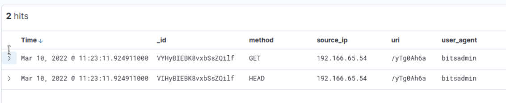
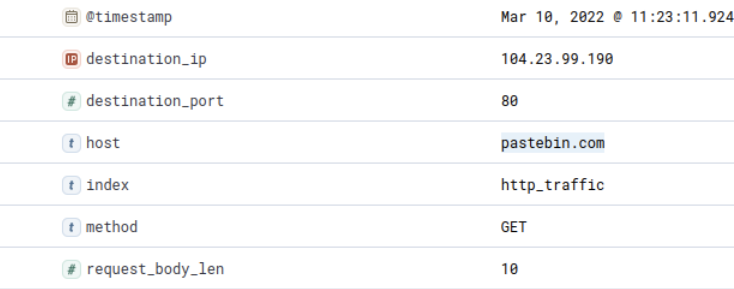

# ItsyBitsy

## Overview

"Put your ELK knowledge together and investigate an incident."

## Key Concepts

- SIEM Triage
- C2 Communication
- IDS alert investigation
- Elastic

## Investigation Steps

### How many events were returned for the month of March 2022?

I navigated to the Elastic SIEM tool, and then calibrated the logs to show all of March 2022. From here I could see how many events I had logged.

Answer: 1482

### What is the IP associated with the suspected user in the logs?

Upon Investigating the source ip addresses, I only found one ip address displayed. I tried this, but found that it wasn't the answer I needed. From here it felt natural to exclude this ip address and see if any other Source ip addresses could be found. I used "not (source_ip : 192.166.65.52)" command to filter the logs, which resulted in 2 logs, both with the same source ip. This was the compromised ip address.

Answer: 192.166.65.54

### The user’s machine used a legit windows binary to download a file from the C2 server. What is the name of the binary?

From the last question, I had 2 event logs, so I knew the answer would be within one of the fields here. Analysing the fields, I found "user_agent" looked interesting. The user agent for both events was "bitsadmin", and knowing we are looking for something related to binary, this seemed to fit what I was looking for. I looked it up and found it to be a windows command-line tool and can be used for malicious file transfering, and common in living off the land attacks.

Answer: bitsadmin

### The infected machine connected with a famous filesharing site in this period, which also acts as a C2 server used by the malware authors to communicate. What is the name of the filesharing site?

Investigating further into the logs, the host field revealed outbound comminication to "pastebin.com", which I know is an website that can store text online. This is the filesharing website the attacker is using as a c2 server.

Answer: pastebin.com

### What is the full URL of the C2 to which the infected host is connected?

Further field analysis lead me to the URI, which appeared to be a subdirectory / path for a url. Combining it with the domain we gathered from the previous question, I gathered the full URL that I required.

Answer: pastebin.com/yTg0Ah6a

### A file was accessed on the filesharing site. What is the name of the file accessed?

I Investigated the logs to see If any further information could be optained here. Once I deduced no further information could be used, I went to the pastebin URL page I created from previous question. This took me to the webpage storing the text file the c2 attack managed to exfiltrate.

Answer: secret.txt

### The file contains a secret code with the format THM{_____}.

As per the last question, I looked at the pastebin page, and saw the text files contents, which contained the code for this question.

Answer: THM{SECRET__CODE}

## Key Findings

- Analysis of Elastic SIEM logs identified suspicious outbound communication to **pastebin.com** Indicating potential c2 activity.
- The infected host (192.166.65.54) used legitimate Windows binary **bitsadmin** to download remote content.
- The use of **bitsadmin** suggests possible living-off-the-land techniques to evade detection
- The attacker leveraged **pastebin.com** as a c2 server to host and retrieve malicious content.
- A file **secret.txt** was retrieved from the remote server, confirming successful c2 and exfiltration.

## Important notes

- **bitsadmin** is a legitimate Windows binary that can be abused for file transfer and malware delivery.
- Pastebin is frequently used in attacks as a lightweight C2 channel for hosting payloads or commands.
- SIEM tools such as Elastic can be used to:
  - Filter logs by time range
  - Identify anomalous IP activity
  - Correlate user-agent and network indicators
- URI fields can be combined with host/domain fields to reconstruct full URLs

## Takeaways

This lab reinforced key SOC investigation skills in identifying command-and-control (C2) activity within a SIEM environment.

- Gained practical experience using Elastic SIEM for log filtering and analysis.
- Identified the use of living-off-the-land binaries, specifically bitsadmin.
- Developed understanding of how legitimate platforms (eg pastebin) can be abused for c2 communication.
- Strengthened ability to correlate network indicators (IP, domain, URI) to reconstruct malicious activity.

This lab simulated a basic SOC triage scenario involving detection of c2 communication and analysis of attacker techniques.