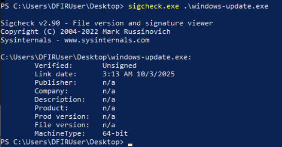
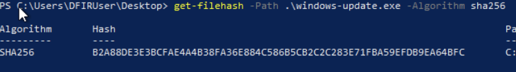
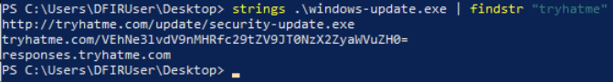
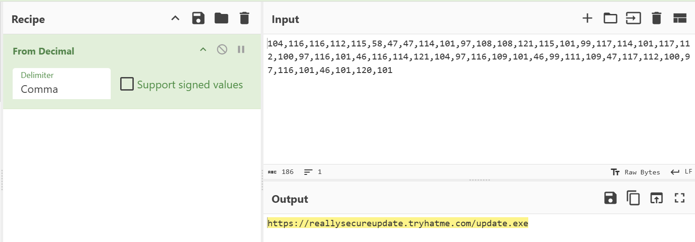

# Shadow Trace

## Overview

"Analyse a suspicious file, uncover hidden clues, and trace the source of the infection"

## Key Concepts

- Malware Concepts
- Gather IOCs (Indicators of Compromise) from binaries
- Correlating alerts with malicious activity
- Basic SOC triage

## Investigation Steps

### What is the architecture of the binary file windows-update.exe?

I tried commands I would normally use in file analysis, however most commands I am aware of are for Linux. Therefore I did some research, which led me to the powershell command: sigcheck.

This gave me some file information, including the header - MachineType which contained the answer I needed.

Answer: 64-bit

### What is the hash (sha-256) of the file windows-update.exe?

Additional research indentified the windows equivalent to the linux command that I know (sha256sum). This led me to two options: certutil in Command Prompt or get-filehash in Powershell.

I decided to go with the powershell command get-filehash, along with the required headers and fields, which resulted in the sha256 hash.

Answer: B2A88DE3E3BCFAE4A4B38FA36E884C586B5CB2C2C283E71FBA59EFDB9EA64BFC

### Identify the URL within the file to use it as an IOC

I searching the sha256 hash on VirusTotal, which as a result provided me with a lot of information about the file, including the fact that it is malicious and shows signs of ransomware and a trojan threat label.

Among the information here, I identified the url that is required (an Indicator of Compromise).

Answer: http://tryhatme[.]com/update/security-update.exe

### With the URL identified, can you spot a domain that can be used as an IOC?

I knew from the previous question that the "tryhatme" domain was what i needed to search for, So I used strings along with findstr in powershell to find all mentions of tryhatme. This led me to the domain I needed.

Answer: responses.tryhatme.com

### Input the decoded flag from the suspicious domain

From the outputs in the previous question, the middle output stood out to me as it looked base64 encoded. I took this string and put it into the CyberChef tool and decoded the base64. The result was the flag I needed.

Answer: THM{you_g0t_some_IOCs_friend}

### What library related to socket communication is loaded by the binary?

This required a bit of probing to figure out. Firstly I used strings and findstr to see if "Socket" was present. I discovered socket appeared twice, but no further information other than Socket creation had failed. Therefore, I had to use strings to output the whole file and search for the area the socket attempted to be established.

I found the line "WSAStartup failed:" above the socket failed line I had seen earlier. A quick google search showed that WSAStartup was what I was looking for. WSAStartup is a windows socket function that initialises the "ws2_32.dll" library.

Answer: ws2_32.dll

### Can you identify the malicious URL from the trigger by the process powershell.exe?

A website for this part was required, that showed a SOC alert page. There were 2 alerts, the first being a web download request. The website it was downloading from was base64 encoded, and therefore required cyberchef to decipher the encoding. This revealed the malicious url.

Answer: https://tryhatme.com/dev/main.exe

### Can you identify the malicious URL from the alert triggered by chrome.exe?

The second SOC alert featured another encoding. There is a sequence of numbers in an array, which gets converted to a corresponding character in numeric code. Again i used CyberChef to decipher this, using the From Decimal recipe (with comma delimiter).

Answer: https://reallysecureupdate.tryhatme.com/update.exe

### What's the name of the file saved in the alert triggered by chrome.exe?

Looking further into the second SOC alert, there is a file within the command. This is the file we need.

Answer: test.txt

## Key Findings

- The analysed binary is a 64-bit executable, which was identified as malicious.
- SHA-256 hash confirms malicious classification via VirusTotal.
- Multiple IOCs where Identified:
    - URL: http://tryhatme[.]com/update/security-update.exe
    - Domain: responses.tryhatme.com
    - Additional malicious URLs from alerts
- The binary utilises 'ws2_32.dll' socket library indicating network communication capabilities.
- Encoded data was used to obfuscate malicious infrastructure (Base64 and Decimal.)

## Important notes

- SHA-256 hashes can be generated in Windows using:
    - Powershell: "get-filehash"
    - Command Prompt: "certutil -hashfile"

- sigcheck can be used to extract metadata from windows binaries, including architecture.

- Indicators of Compromise (IOCs) include:
    - File Hashes
    - Domains
    - URLs

- Base64 encoding is commonly used to obfuscate malicious data and can be decoded using tools like CyberChef.

- ws2_32.dll library is associated with Windows Socket Communication and may indicate network activity.

- Tools used:
    - VirusTotal - Threat Intelligence
    - CyberChef - Decoding / Encoding
    - Powershell - File and string analysis

## Takeaways

This room reinforced key SOC analyst skills, particularly in malware analysis and IOC identification.

- Gained practical experience analysing suspicious binary using Windows-based tools such as PowerShell and sigcheck.
- Improved ability to extract and interpret Indicators of Compromise, including hashes, domains and URLs.
- Strengthened familiarity with threat intelligence platforms such as VirusTotal to validate suspicious files.
- Practiced decoding obfuscated data (Base64, decimal encoding), which is commonly used to mask malicious activity.
- Strengthened understanding of how malware may leverage system libraries for network communication (ws2_32.dll.)
- Applied basic investigation techniques to correlate alerts in a SIEM-like environment.

This lab simulated real-world SOC triage, including identifying malicious activity, extracting IOCs and analysing alerts.